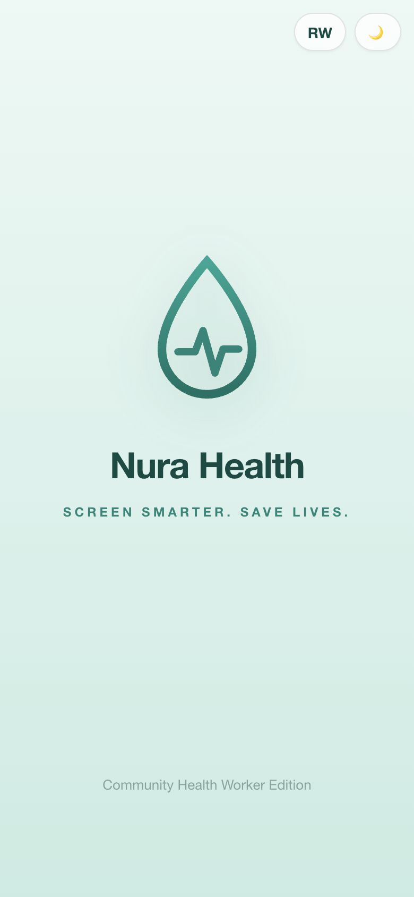
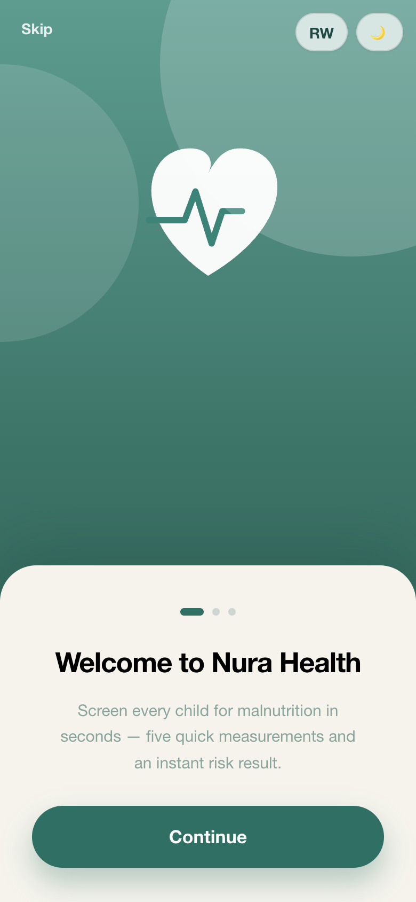
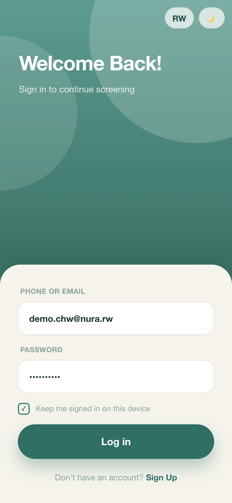
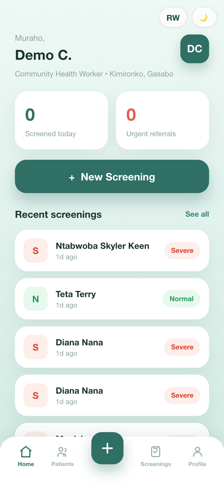
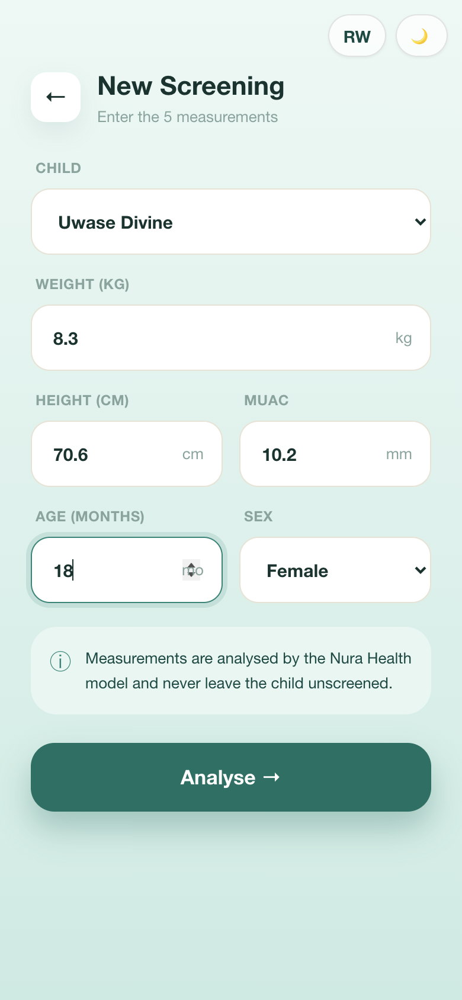
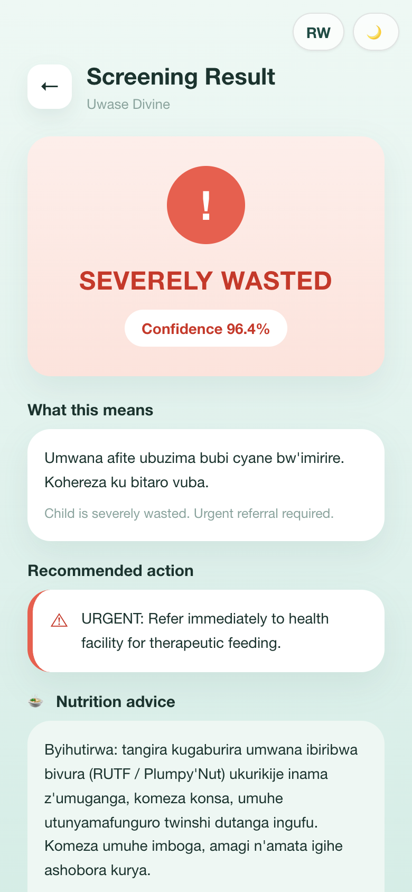
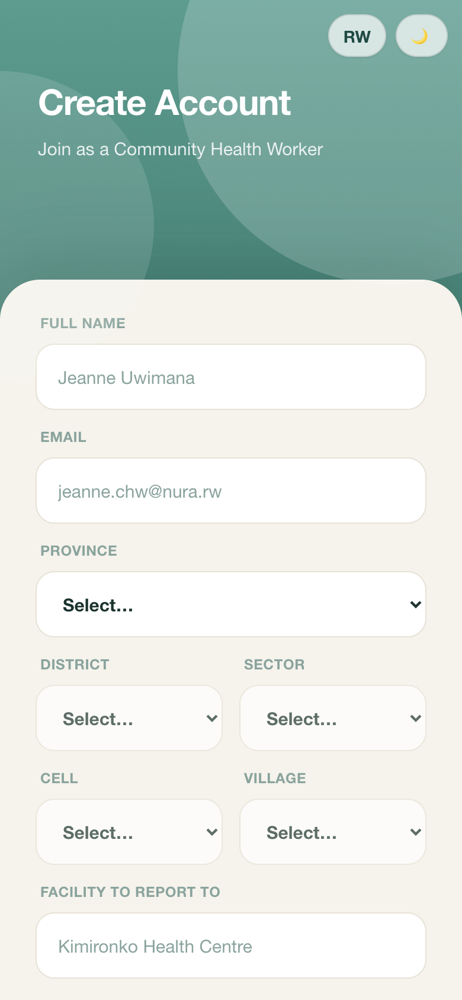
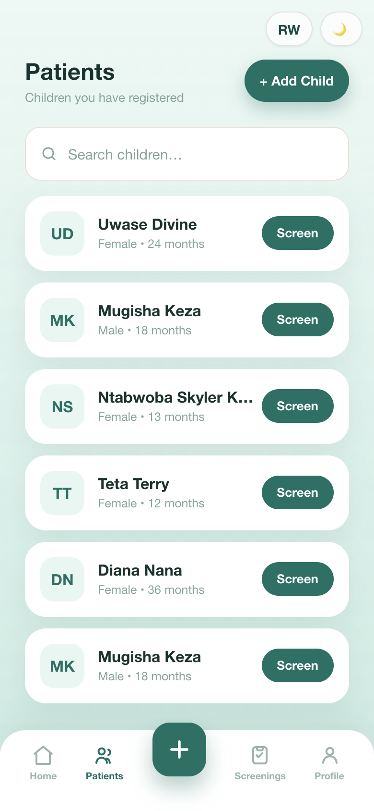
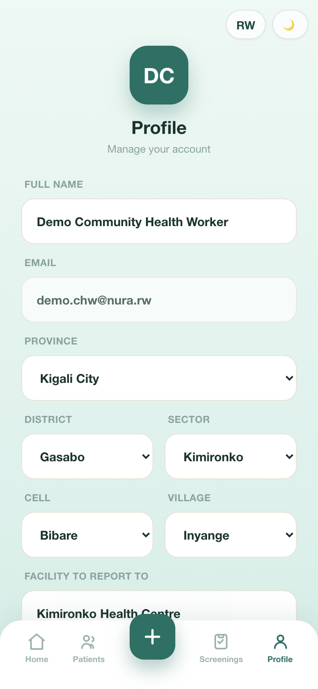

# Nura Health Child Malnutrition Screening

Nura Health helps community health workers (CHWs) in Rwanda screen children under 5
for malnutrition. Instead of a single MUAC-tape reading (which research shows misses
20–45% of wasted children), a CHW enters **5 measurements** — weight, height, MUAC,
age, sex — and an ensemble ML model instantly classifies the child as **normal**,
**wasted**, or **severely wasted**, with a confidence score, a Kinyarwanda message,
and a recommended action.

- **Best model:** XGBoost — **93.02% accuracy** on real Rwanda DHS 2020 data.
- **Data:** Rwanda DHS 2019–20 (Children's Recode), labelled with **WHO 2006**
  weight-for-height z-score thresholds.

> **GitHub repo:** <https://github.com/Carine-Ashimwe/Nura-health.git>

> **YouTube link:** <https://drive.google.com/drive/folders/1i5_dVoWPqasXdEz8PiKOn8MHgMf_nqhx>


---

## Repository Layout

This repo contains a **separated backend and frontend** :

```
Nurahealth/
├── nurahealth_backend/      # Python — ML model, data pipeline, FastAPI API
│   ├── api/main.py          #   FastAPI: /health + /predict/child-malnutrition (Swagger at /docs)
│   ├── notebooks/           #   Full ML training notebook (with saved outputs)
│   ├── models/*.joblib      #   Trained models (XGBoost is the best)
│   ├── data/                #   Cleaned Rwanda DHS CSV + data-prep script
│   ├── outputs/             #   Training plots (EDA, SMOTE, SHAP, confusion matrices)
│   ├── docs/screenshots/    #   Real app interface screenshots
│   ├── requirements.txt
│   └── README.md            #   Detailed backend / ML documentation
│
└── nurahealth_frontend/     # Next.js 14 + TypeScript — the working MVP web app (PWA)
    ├── app/                 #   App Router pages: splash, onboarding, login, register,
    │                        #     home, screening, result, patients, profile
    ├── app/api/             #   Server routes: /api/auth/*, /api/predict, /api/screenings,
    │                        #     /api/children  (predict proxies to the FastAPI model)
    ├── prisma/schema.prisma #   Database schema (User, Child, Screening)
    ├── messages/            #   i18n strings — en.json + rw.json (Kinyarwanda)
    ├── scripts/seed.mjs     #   Seeds the demo CHW account
    └── package.json
```

The **Next.js frontend calls the FastAPI backend** over HTTP (via the
`/api/predict` server route), so they run as two processes.

---

## Quick Start

> Prerequisites: **Python 3.9+** and **Node.js 18+** (with npm).

### Option A — one command (recommended)

From the repo root:

```bash
./run_demo.sh
```

This creates the Python venv, installs both backends' dependencies, prepares the
local SQLite database, seeds the demo account, and starts:

- Backend API → http://127.0.0.1:8000 (Swagger UI at `/docs`)
- Frontend → http://127.0.0.1:3000

Press **Ctrl+C** to stop both.

### Option B — two terminals (manual)

**Terminal 1 — Backend ML API (port 8000)**

```bash
cd nurahealth_backend
python3 -m venv venv
source venv/bin/activate        # Mac/Linux  (Windows: venv\Scripts\activate)
pip install -r requirements.txt
uvicorn api.main:app --reload   # Swagger UI at http://127.0.0.1:8000/docs
```

**Terminal 2 — Frontend web app (port 3000)**

```bash
cd nurahealth_frontend
cp .env.example .env            # then edit values if needed (see below)
npm install
npm run db:push                 # create the local SQLite schema
npm run db:seed                 # seed the demo CHW account
npm run dev                     # open http://127.0.0.1:3000
```

### Environment variables (`nurahealth_frontend/.env`)

```
DATABASE_URL="file:./dev.db"          # SQLite for local dev (Postgres in prod)
ML_API_URL="http://127.0.0.1:8000"    # where the FastAPI model is reachable
AUTH_SECRET="change-me"               # secret used to sign JWT sessions
```

### Demo login

A demo account is seeded automatically by `npm run db:seed`:

- **Email:** `demo.chw@nura.rw`
- **Password:** `Demo@12345`

You can also **register** a brand-new account from the UI.

---

## Designs / App Screens

These are **real screenshots captured from the running Next.js app** (iPhone @2x).

| Splash | Onboarding | Login |
|---|---|---|
|  |  |  |

| Home | Screening | Result |
|---|---|---|
|  |  |  |

| Register | Patients | Profile |
|---|---|---|
|  |  |  |

**Navigation flow:** Splash → Onboarding → Login / Register → **Home** dashboard →
New **Screening** (5 inputs) → colour-coded **Result** → Patients / Profile (bottom nav).

---

## API Endpoints

**ML backend — FastAPI** (`nurahealth_backend/api/main.py`):

| Method | Path | Purpose |
|---|---|---|
| `GET`  | `/health` | Service + model status |
| `POST` | `/predict/child-malnutrition` | Run the malnutrition classifier |

**App backend — Next.js route handlers** (`nurahealth_frontend/app/api/*`):

| Method | Path | Purpose |
|---|---|---|
| `POST` | `/api/auth/register` | Create a CHW account |
| `POST` | `/api/auth/login` | Log in (JWT session cookie) |
| `POST` | `/api/auth/logout` | Log out |
| `POST` | `/api/predict` | Proxy to the FastAPI classifier (hides `ML_API_URL`) |
| `GET`/`POST` | `/api/children` | List / create child profiles |
| `GET`/`POST` | `/api/screenings` | List / create screening records |

---

## Database Schema (Prisma)

Defined in `nurahealth_frontend/prisma/schema.prisma`:

- **User** — the CHW (name, email, password hash, location: province/district/sector/
  cell/village, reporting facility).
- **Child** — a screened child (name, sex, age in months, caregiver, village),
  linked to the CHW who registered them.
- **Screening** — one screening event (weight, height, MUAC, age, sex, classification,
  confidence), linked to a Child and a User.

SQLite is used locally (`prisma/dev.db`); PostgreSQL (Neon) is used in production —
only `DATABASE_URL` changes.

---

## Datasets

- **Rwanda DHS 2019–20** (Children's Recode, `RWKR81DT`) — 3,436 children under 5
  after cleaning — provides the anthropometric measurements.
---

## Deployment Plan

| Component | Now (MVP) | Later (production) |
|---|---|---|
| ML API (FastAPI) | Local `uvicorn` on port 8000 | Railway / Render |
| Frontend (Next.js) | Local `next dev` on port 3000 | Vercel / Netlify |
| Models | Bundled `.joblib` files in the repo | Same, or model registry |
| Database | Prisma + local **SQLite** (`dev.db`) | Prisma + **PostgreSQL** (Neon) |

---
