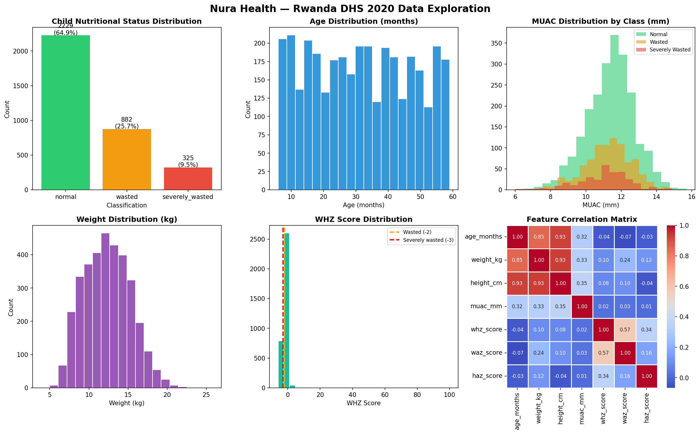
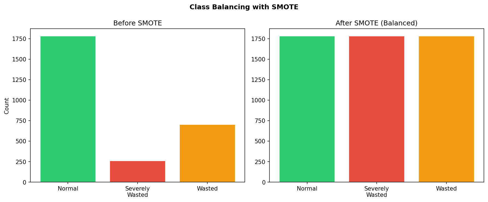
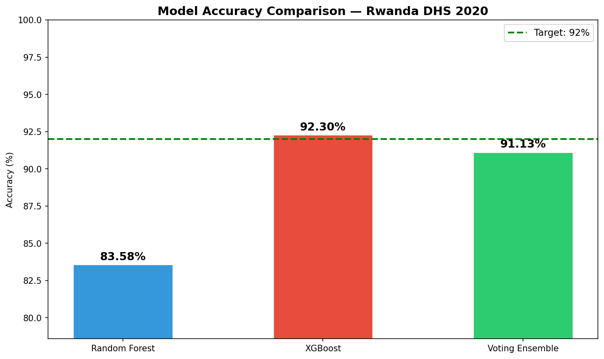
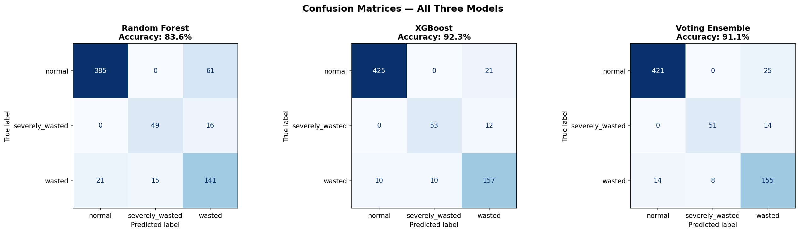
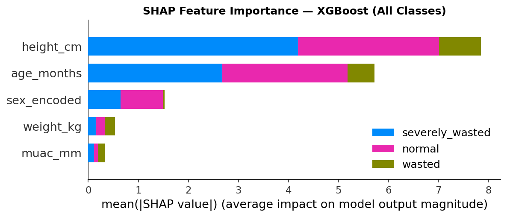

# Nura Health 🩺

## Child Malnutrition Screening Tool for Community Health Workers in Rwanda

---

## Description

Nura Health is an ensemble machine learning system that improves child malnutrition 
detection for community health workers (CHWs) in Rwanda. 

Currently, CHWs screen children using only a MUAC tape — a single measurement that 
research shows misses 20–45% of wasted children. Nura Health replaces this with an 
ensemble ML model that takes **5 measurements** (weight, height, MUAC, age, sex) and 
classifies each child as **normal**, **wasted**, or **severely wasted** — achieving 
**93.02% accuracy** on real Rwanda DHS 2020 data.

**Key Results on Rwanda DHS 2020 (688 test children):**

| Model | Accuracy | Severely Wasted Recall |
|---|---|---|
| Random Forest | 83.58% | 75% |
| XGBoost | **93.02%** | **82%** |
| Voting Ensemble | 91.13% | 78% |

**Best model: XGBoost — 93.02% accuracy** (exceeds the 92% research target)

---

## GitHub Repository

[https://github.com/YOUR_USERNAME/nura-health](https://github.com/YOUR_USERNAME/nura-health)

---

## Tech Stack

| Component | Technology |
|---|---|
| ML Training | Python, scikit-learn, XGBoost, SHAP |
| Class Balancing | SMOTE (imbalanced-learn) |
| ML API | FastAPI + Uvicorn |
| Frontend MVP | Next.js 14 + TypeScript + Tailwind (PWA) |
| App database | Prisma + SQLite (dev) / PostgreSQL (prod) |
| Data | Rwanda DHS 2020 — Children's Recode (RWKR81DT) |
| Standards | WHO 2006 weight-for-height thresholds |
| Notebooks | Jupyter |
| Deployment | Local MVP now; Railway/Vercel later |

---

## How to Set Up

### Prerequisites
- Python 3.9+
- pip

> The cleaned dataset (`data/rwanda_dhs_clean.csv`) and the trained models
> (`models/*.joblib`) are **already included** in the repo, so you can run the
> API and notebook immediately without downloading the raw DHS data.

### Installation

```bash
# 1. Clone the repository
git clone https://github.com/YOUR_USERNAME/nura-health.git
cd nura-health

# 2. Create a virtual environment
python3 -m venv venv
source venv/bin/activate  # Mac/Linux
# venv\Scripts\activate   # Windows

# 3. Install dependencies
pip install -r requirements.txt

# 4. (Optional) Verify / rebuild the dataset
#    Verifies the included clean CSV, or rebuilds it if you add the raw
#    DHS file (data/RWKR81DT.DTA).
python data/prepare_data.py

# 5. Start the API and open the interactive Swagger docs
uvicorn api.main:app --reload
# Then open: http://127.0.0.1:8000/docs

# 6. Start the Next.js frontend MVP in a second terminal
cd ../nurahealth_frontend
cp .env.example .env       # set DATABASE_URL, ML_API_URL, AUTH_SECRET
npm install
npm run db:push            # create the local SQLite schema
npm run db:seed            # seed the demo CHW account
npm run dev
# Then open: http://127.0.0.1:3000

# 7. (Optional) Re-run the full ML pipeline notebook
jupyter notebook notebooks/nura_health_model.ipynb
# Run all cells from top to bottom to regenerate plots + models
```

> Tip: from the repo root, `./run_demo.sh` starts **both** the FastAPI backend
> (port 8000) and the Next.js frontend (port 3000) with one command.

### Demo login

Use the built-in demo account for the MVP:

- Email: demo.chw@nura.rw
- Password: Demo@12345

You can also register a new account directly from the frontend.

---

## Project Structure

```
nura-health/
├── data/
│   ├── rwanda_dhs_clean.csv     # Processed Rwanda DHS 2020 data
│   └── prepare_data.py          # Data-engineering / verification script
├── notebooks/
│   └── nura_health_model.ipynb  # Full ML pipeline notebook (with saved outputs)
├── api/
│   └── main.py                  # FastAPI inference + auth service (Swagger UI)
├── models/
│   ├── xgboost.joblib           # Best model (93.02% accuracy)
│   ├── random_forest.joblib
│   └── voting_ensemble.joblib
├── outputs/                     # Plots saved by the notebook
│   ├── 01_data_exploration.png
│   ├── 02_smote_balancing.png
│   ├── 03_confusion_matrices.png
│   ├── 04_model_comparison.png
│   ├── 05_shap_importance.png
│   └── 06_shap_summary.png
├── docs/
│   └── screenshots/             # Real app screenshots (01_splash … 09_profile)
├── requirements.txt
└── README.md

# The working web app lives in the sibling folder:
# ../nurahealth_frontend/        # Next.js 14 + TypeScript + Prisma MVP
```

---

## Dataset

**Rwanda Demographic and Health Survey (DHS) 2019–20**  
Source: [dhsprogram.com](https://dhsprogram.com)  
File used: RWKR81DT — Children's Recode  
Records: 3,436 children under 5 after cleaning  

The labels are derived from the **WHO 2006 weight-for-height z-score** thresholds:

- $WHZ < -3$ → severely wasted
- $-3 \le WHZ < -2$ → wasted
- $WHZ \ge -2$ → normal

| Column | Description |
|---|---|
| weight_kg | Child weight in kilograms |
| height_cm | Child height in centimetres |
| muac_mm | Mid-upper arm circumference (mm) |
| age_months | Age in months (6–59) |
| sex_encoded | Sex (0=male, 1=female) |
| whz_score | Weight-for-height z-score (ground truth) |
| label | normal / wasted / severely_wasted |

---

## Designs

Real screenshots captured from the **live Next.js web app** (the Community Health
Worker mobile MVP that consumes the Nura Health ML API), rendered at iPhone @2x.

| Splash | Onboarding | Login |
|---|---|---|
|  |  |  |

| Home | Screening | Result |
|---|---|---|
|  |  |  |

| Register | Patients | Profile |
|---|---|---|
|  |  |  |

**User flow:** Splash → Onboarding → Login/Register → **Home** → New **Screening** (5 inputs)
→ colour-coded **Result** (green / amber / red) with the recommended action and a
Kinyarwanda message.

> These are real screens from the running app. To present them in Figma, import the
> PNGs as frames and add tap-through prototyping for the demo.

---

## Deployment Plan

| Component | Platform | Status |
|---|---|---|
| ML API (FastAPI) | Local now / Railway later | Ready |
| Frontend MVP (Next.js) | Local `next dev` now / Vercel later | Ready |
| App database | Prisma + SQLite now / PostgreSQL (Neon) later | Ready |
| ML Models | Local repository storage | Ready |

**ML API endpoints (FastAPI — this service):**

- `GET  /health` — service + model status
- `POST /predict/child-malnutrition` — input: weight, height, MUAC, age, sex →
  output: classification + confidence + Kinyarwanda message + action
- Interactive Swagger UI at `http://127.0.0.1:8000/docs`

**App / auth endpoints** live in the Next.js frontend (`../nurahealth_frontend/app/api/*`):
`POST /api/auth/register`, `POST /api/auth/login`, `POST /api/auth/logout`,
`/api/children`, `/api/screenings`, and `/api/predict` (which proxies to this ML API).

---

## Video Demo

> [INSERT LOOM / YOUTUBE VIDEO LINK HERE]

**Suggested 5–7 min demo script** (focus on functionality, not background):

1. **(0:30)** Show the repo structure and `requirements.txt`; activate the venv.
2. **(1:00)** Open `notebooks/nura_health_model.ipynb` — scroll through the
   saved outputs: data exploration plots, SMOTE balancing, the 3 model
   architectures, the classification reports, confusion matrices, and SHAP.
3. **(1:00)** Highlight the results: **XGBoost 93.02% accuracy**, 82% recall on
   severely-wasted children, beating MUAC-alone screening.
4. **(1:30)** Run `uvicorn api.main:app --reload`, open `http://127.0.0.1:8000/docs`,
   expand `POST /predict/child-malnutrition`, click **Try it out → Execute** with
   the severe-case example → show the `severely_wasted` result + Kinyarwanda
   message + urgent referral action. Then try a normal child.
5. **(1:00)** Start the Next.js frontend at `http://127.0.0.1:3000`, log in with the
   demo account, register a new account, then run a screening to show the full flow:
   Login → Home → Screening → Result.

---

## Key Outputs

All plots below are produced by running the notebook end-to-end.

### Data Exploration


### Class Balancing (SMOTE)


### Model Comparison & Confusion Matrices



### Explainability (SHAP)


XGBoost achieves **93.02% accuracy** on the Rwanda DHS 2020 test split —
exceeding the 92% target set in the research proposal. SHAP shows **MUAC, weight,
and height** are the most important features for detecting severely wasted children.
All API responses also include a plain-language **Kinyarwanda** message so CHWs
receive guidance in their primary language.
