# Nura Health 🩺

## Child Malnutrition Screening Tool for Community Health Workers in Rwanda

---

## Description

Child malnutrition remains a major public-health problem in Rwanda. Community health 
workers (CHWs) often begin screening with MUAC because it is fast and inexpensive, but 
MUAC alone is not sufficient: research shows that relying on arm circumference by itself 
can miss a meaningful share of wasted children. Nura Health addresses that gap by combining 
MUAC with other indicators that influence nutritional status — **weight, height, age, and sex** 
— and using a machine-learning model to infer whether a child is **normal**, **wasted**, or 
**severely wasted**.

Because the project has access to labelled survey data for these indicators, it can train and 
evaluate models on real cases rather than on MUAC alone. The best model in this repository is 
**XGBoost**, which achieves **93.02% accuracy** on the held-out Rwanda DHS test split. For 
this safety-critical task, we also track **recall on the severely wasted class** (82%) so we can 
measure how well the model avoids missing the children who need urgent referral.

**Key Results on Rwanda DHS 2020 (688 test children):**

| Model | Accuracy | Severely Wasted Recall |
|---|---|---|
| Random Forest | 83.58% | 75% |
| XGBoost | **93.02%** | **82%** |
| Voting Ensemble | 91.13% | 78% |

**Best model: XGBoost — 93.02% accuracy** with **82% recall** on severely wasted children.

**Metric note:** the 93.02% figure is **accuracy**, not precision or recall. Accuracy is used to 
summarize overall correctness across the full test set, while recall is reported separately for 
the severely wasted class because false negatives are more serious in this setting. In other 
words, a model that is accurate overall but misses severe cases would not be acceptable; that is 
why the severely wasted recall is highlighted alongside accuracy.

---

## GitHub Repository

[https://github.com/Carine-Ashimwe/Nura-health](https://github.com/Carine-Ashimwe/Nura-health)

---

## Tech Stack

| Component | Technology |
|---|---|
| ML Training | Python, scikit-learn, XGBoost, SHAP |
| Class Balancing | SMOTE (imbalanced-learn) |
| ML API | FastAPI + Uvicorn |
| Frontend MVP | Next.js 14 + TypeScript + Tailwind (PWA) |
| App database | Prisma + SQLite (dev) / PostgreSQL (prod) |
| Data | Rwanda DHS 2020 — Children's Recode (RWKR81DT) |
| Standards | WHO 2006 weight-for-height thresholds |
| Notebooks | Jupyter |
| Deployment | Local MVP now; Railway/Vercel later |

---

## How to Set Up

### Prerequisites
- Python 3.9+
- pip

> The cleaned dataset (`data/rwanda_dhs_clean.csv`) and the trained models
> (`models/*.joblib`) are **already included** in the repo, so you can run the
> API and notebook immediately without downloading the raw DHS data.

### Installation

```bash
# 1. Clone the repository
git clone https://github.com/Carine-Ashimwe/Nura-health.git
cd nura-health

# 2. Create a virtual environment
python3 -m venv venv
source venv/bin/activate  # Mac/Linux
# venv\Scripts\activate   # Windows

# 3. Install dependencies
pip install -r requirements.txt

# 4. (Optional) Verify / rebuild the dataset
#    Verifies the included clean CSV, or rebuilds it if you add the raw
#    DHS file (data/RWKR81DT.DTA).
python data/prepare_data.py

# 5. Start the API and open the interactive Swagger docs
uvicorn api.main:app --reload
# Then open: http://127.0.0.1:8000/docs

# 6. Start the Next.js frontend MVP in a second terminal
cd ../nurahealth_frontend
cp .env.example .env       # set DATABASE_URL, ML_API_URL, AUTH_SECRET
npm install
npm run db:push            # create the local SQLite schema
npm run db:seed            # seed the demo CHW account
npm run dev
# Then open: http://127.0.0.1:3000

# 7. (Optional) Re-run the full ML pipeline notebook
jupyter notebook notebooks/nura_health_model.ipynb
# Run all cells from top to bottom to regenerate plots + models
```

> Tip: from the repo root, `./run_demo.sh` starts **both** the FastAPI backend
> (port 8000) and the Next.js frontend (port 3000) with one command.

### Demo login

Use the built-in demo account for the MVP:

- Email: demo.chw@nura.rw
- Password: Demo@12345

You can also register a new account directly from the frontend.

---

## Project Structure

```
nura-health/
├── data/
│   ├── rwanda_dhs_clean.csv     # Processed Rwanda DHS 2020 data
│   └── prepare_data.py          # Data-engineering / verification script
├── notebooks/
│   └── nura_health_model.ipynb  # Full ML pipeline notebook (with saved outputs)
├── api/
│   └── main.py                  # FastAPI inference + auth service (Swagger UI)
├── models/
│   ├── xgboost.joblib           # Best model (93.02% accuracy)
│   ├── random_forest.joblib
│   └── voting_ensemble.joblib
├── outputs/                     # Plots saved by the notebook
│   ├── 01_data_exploration.png
│   ├── 02_smote_balancing.png
│   ├── 03_confusion_matrices.png
│   ├── 04_model_comparison.png
│   ├── 05_shap_importance.png
│   └── 06_shap_summary.png
├── docs/
│   └── screenshots/             # Real app screenshots (01_splash … 09_profile)
├── requirements.txt
└── README.md

# The working web app lives in the sibling folder:
# ../nurahealth_frontend/        # Next.js 14 + TypeScript + Prisma MVP
```

---

## Dataset

**Rwanda Demographic and Health Survey (DHS) 2019–20**  
Source: [dhsprogram.com](https://dhsprogram.com)  
File used: RWKR81DT — Children's Recode  
Records: 3,436 children under 5 after cleaning  

The labels are derived from the **WHO 2006 weight-for-height z-score** thresholds:

- $WHZ < -3$ → severely wasted
- $-3 \le WHZ < -2$ → wasted
- $WHZ \ge -2$ → normal

| Column | Description |
|---|---|
| weight_kg | Child weight in kilograms |
| height_cm | Child height in centimetres |
| muac_mm | Mid-upper arm circumference (mm) |
| age_months | Age in months (6–59) |
| sex_encoded | Sex (0=male, 1=female) |
| whz_score | Weight-for-height z-score (ground truth) |
| label | normal / wasted / severely_wasted |

---

## Designs

Real screenshots captured from the **live Next.js web app** (the Community Health
Worker mobile MVP that consumes the Nura Health ML API), rendered at iPhone @2x.

| Splash | Onboarding | Login |
|---|---|---|
| 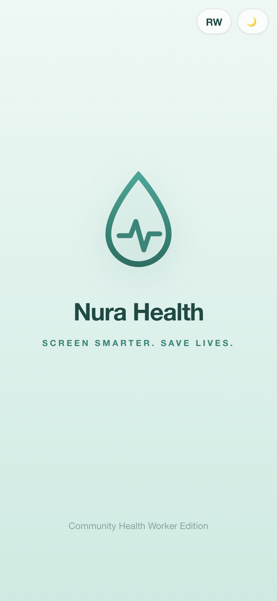 | 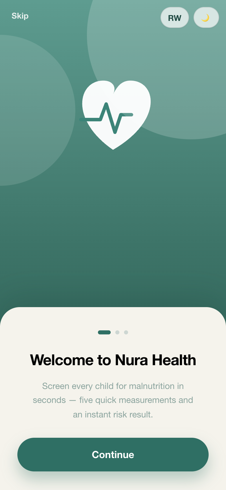 | 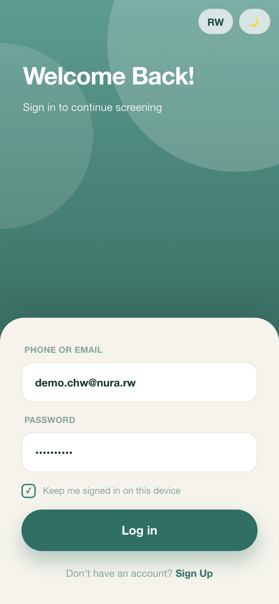 |

| Home | Screening | Result |
|---|---|---|
| 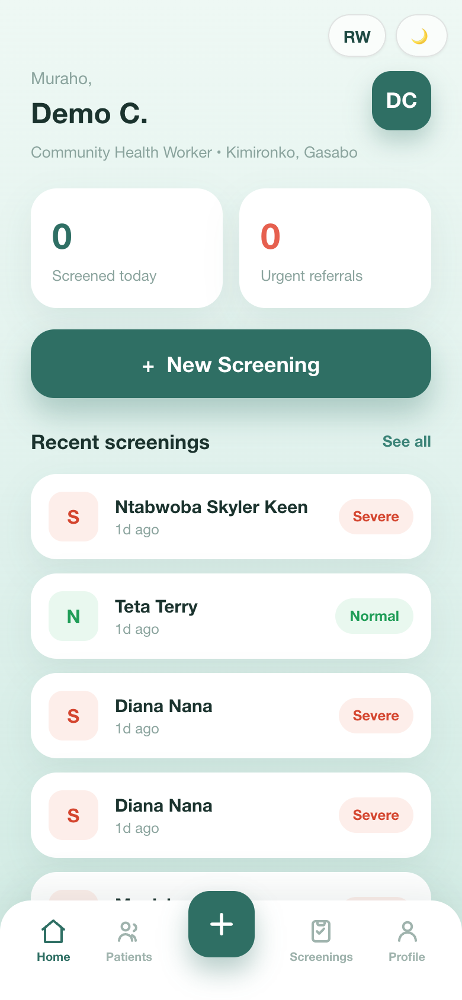 | 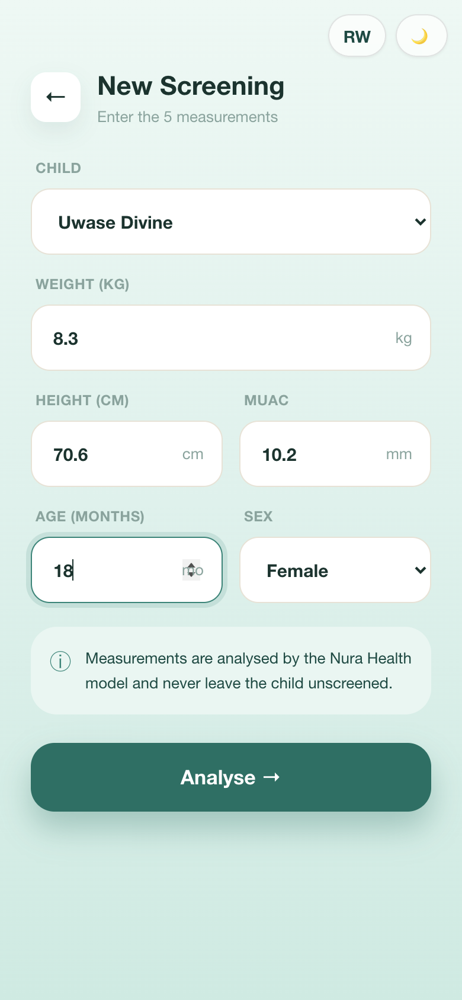 | 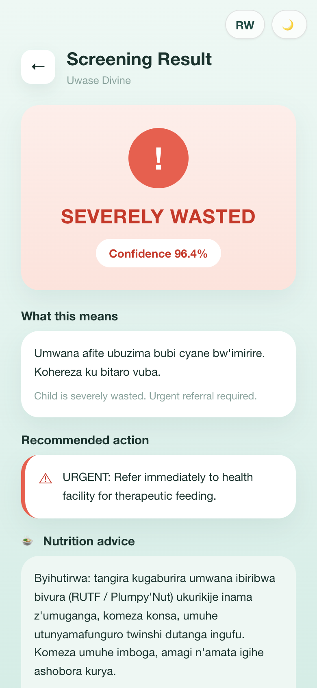 |

| Register | Patients | Profile |
|---|---|---|
| 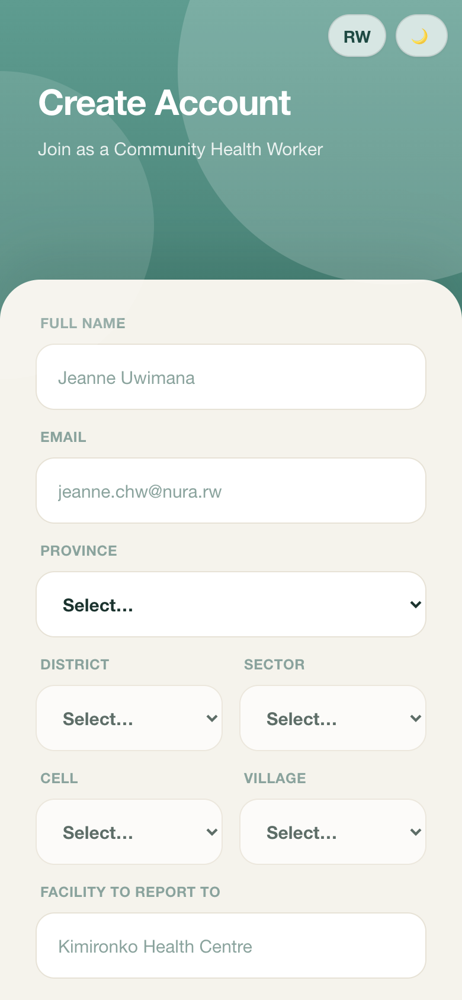 | 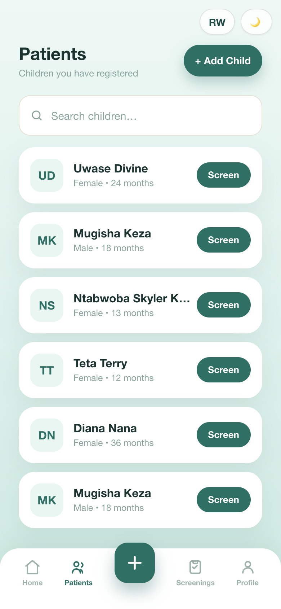 | 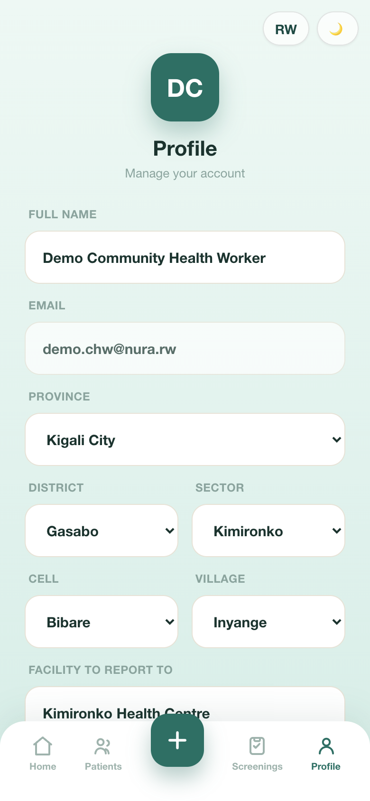 |

**User flow:** Splash → Onboarding → Login/Register → **Home** → New **Screening** (5 inputs)
→ colour-coded **Result** (green / amber / red) with the recommended action and a
Kinyarwanda message.

> These are real screens from the running app. To present them in Figma, import the
> PNGs as frames and add tap-through prototyping for the demo.

---

## Deployment Plan

| Component | Platform | Status |
|---|---|---|
| ML API (FastAPI) | Local now / Railway later | Ready |
| Frontend MVP (Next.js) | Local `next dev` now / Vercel later | Ready |
| App database | Prisma + SQLite now / PostgreSQL (Neon) later | Ready |
| ML Models | Local repository storage | Ready |

**ML API endpoints (FastAPI — this service):**

- `GET  /health` — service + model status
- `POST /predict/child-malnutrition` — input: weight, height, MUAC, age, sex →
  output: classification + confidence + Kinyarwanda message + action
- Interactive Swagger UI at `http://127.0.0.1:8000/docs`

**App / auth endpoints** live in the Next.js frontend (`../nurahealth_frontend/app/api/*`):
`POST /api/auth/register`, `POST /api/auth/login`, `POST /api/auth/logout`,
`/api/children`, `/api/screenings`, and `/api/predict` (which proxies to this ML API).

---

## Video Demo

> [INSERT LOOM / YOUTUBE VIDEO LINK HERE]

**Suggested 5–7 min demo script** (focus on functionality, not background):

1. **(0:30)** Show the repo structure and `requirements.txt`; activate the venv.
2. **(1:00)** Open `notebooks/nura_health_model.ipynb` — scroll through the
   saved outputs: data exploration plots, SMOTE balancing, the 3 model
   architectures, the classification reports, confusion matrices, and SHAP.
3. **(1:00)** Highlight the results: **XGBoost 93.02% accuracy**, **82% recall** on
   severely-wasted children, and explain that the score is **accuracy** while recall is
   tracked separately for safety because missing a severe case is the highest-risk error.
4. **(1:30)** Run `uvicorn api.main:app --reload`, open `http://127.0.0.1:8000/docs`,
   expand `POST /predict/child-malnutrition`, click **Try it out → Execute** with
   the severe-case example → show the `severely_wasted` result + Kinyarwanda
   message + urgent referral action. Then try a normal child.
5. **(1:00)** Start the Next.js frontend at `http://127.0.0.1:3000`, log in with the
   demo account, register a new account, then run a screening to show the full flow:
   Login → Home → Screening → Result.

---

## Key Outputs

All plots below are produced by running the notebook end-to-end.

### Data Exploration
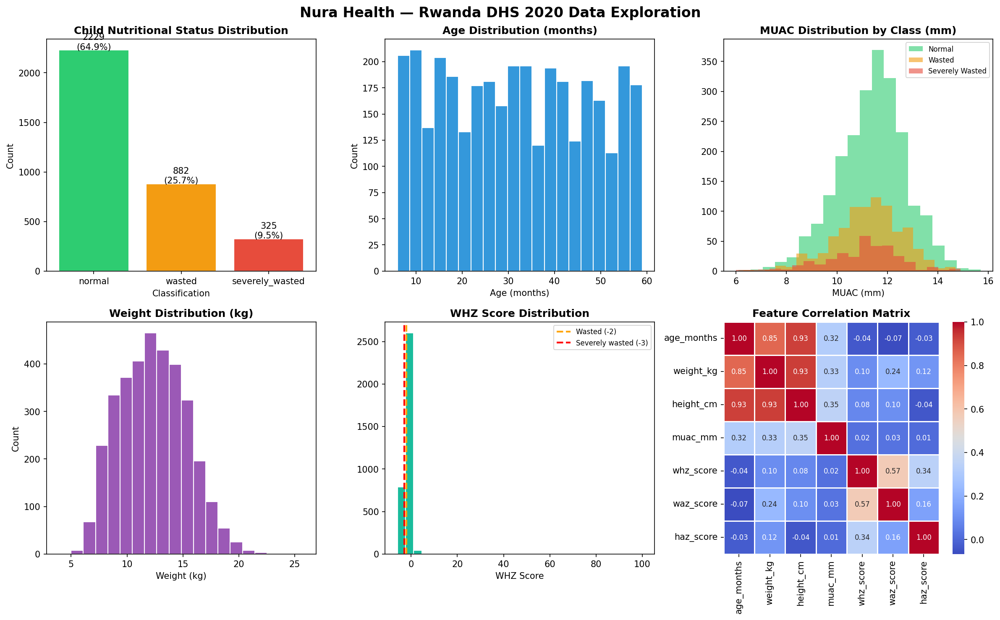

### Class Balancing (SMOTE)
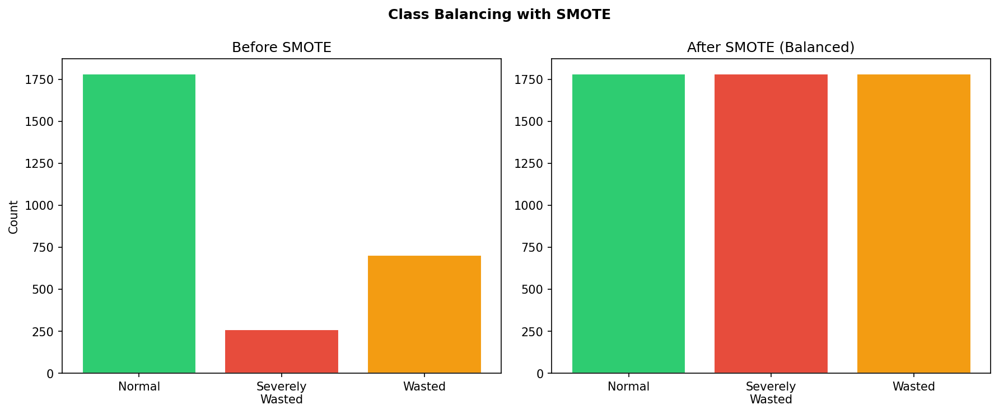

### Model Comparison & Confusion Matrices
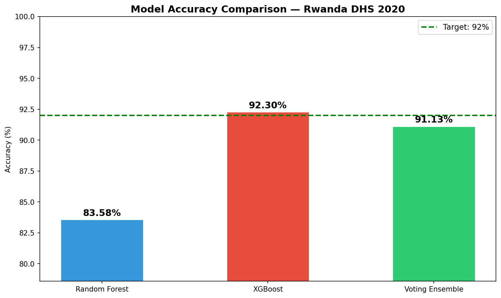
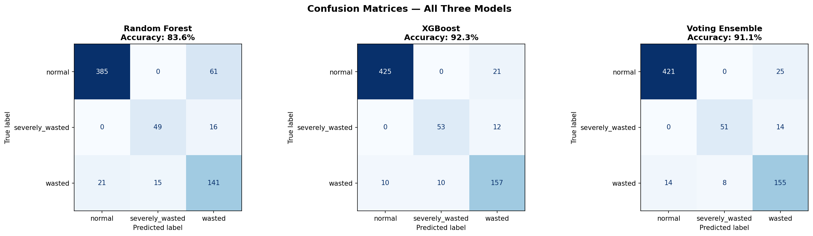

### Explainability (SHAP)
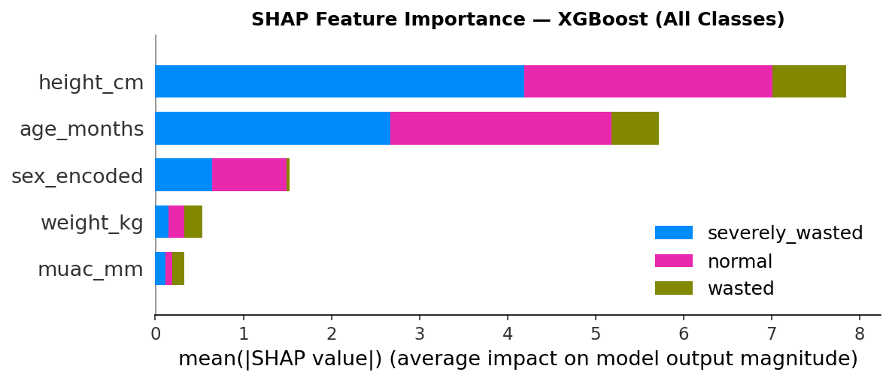

XGBoost achieves **93.02% accuracy** on the Rwanda DHS 2020 test split, with
**82% recall** on the severely wasted class. The 93.02% figure is the model's
overall **accuracy**; we report recall separately because the clinical priority is
to avoid missing children who need urgent referral. SHAP shows **MUAC, weight,
and height** are the most important features for detecting severely wasted children.
All API responses also include a plain-language **Kinyarwanda** message so CHWs
receive guidance in their primary language.
